<!-- _class: lead -->

# Testing Masterclass

<span class="green">Aur Saraf</span>, PyCon IL 2025

<span class="yellow">A hands-on workshop covering the agreed best practices and also <i class="cyan">opinions</i></span>

<a href="https://creativecommons.org/licenses/by-nc/4.0/"></a>

---

<!-- _class: outline-white -->

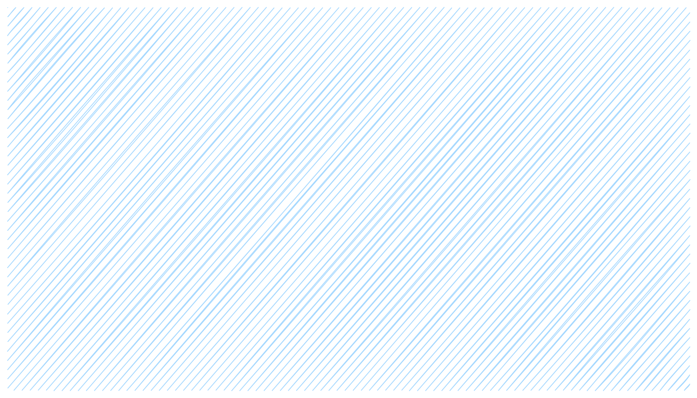

## <span class="green">Intro</span> Who, Why, What

## <span class="green">I</span> xUnit tests

## <span class="green">II</span> Evaluating prompts

## <span class="green">III</span> Mastery

---

<!-- _class: outline-white -->

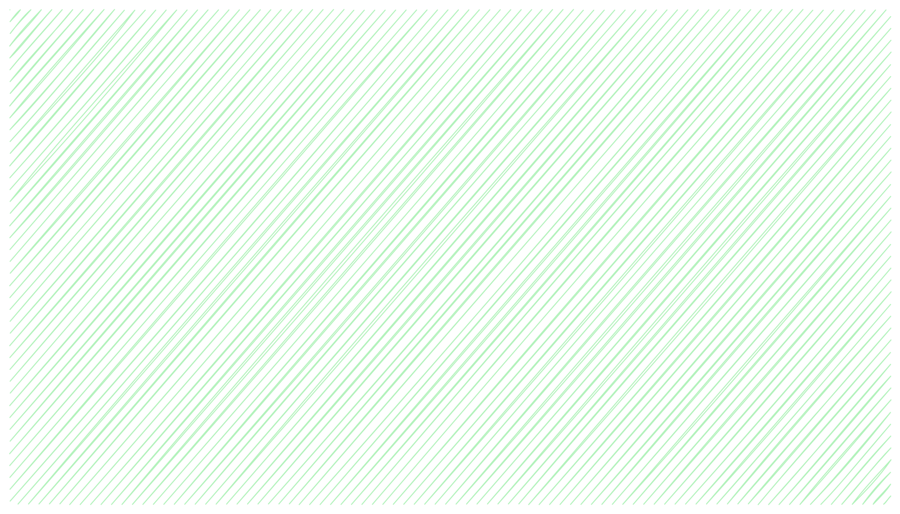

## <span class="green">Intro</span> Who, Why, What

### Who am I?

### Why test?

### What is testing?

## <span class="green">I</span> xUnit tests

## <span class="green">II</span> Evaluating prompts

## <span class="green">III</span> Mastery

---

<div class="flex">

<div>

# Intro

## Who am I?

<div class="red">Aur, startup CTO / consultant</div>
<div class="green">Wrote my first line of BASIC 27 years ago and fell in love</div>
<div class="blue">Run a programming Dojo every Wednesday 20:00 on Zoom</div>

## Why test?

## What is testing?

</div>

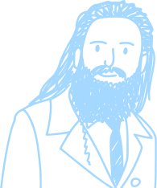

</div>

---

# Intro

## Who am I?

## Why test?

To <span class="green">build products faster</span>
Code <span class="red">never</span> works the first time
Working code <span class="red">won't stay working</span> if we leave it alone

## What is testing?

---

# Intro

## Who am I?

## Why test?

## What is testing?

Any activity that catches mistakes <span class="red">before production</span>
<span class="small">e.g. manual exploration, manual scripts, automated unit tests, automated e2e tests, fuzzing, running past production workloads, statistical evals, ...</span>
Testing is <span class="green">risk management</span>

---

<!-- _class: lead -->

# TESTING IS <span class="green">RISK MANAGEMENT</span>

# TESTING IS <span class="green">RISK MANAGEMENT</span>

# TESTING IS <span class="green">RISK MANAGEMENT</span>

---


## <span class="green">Intro</span> Who, Why, What

## <span class="green">I</span> xUnit tests

#### Lets write a test

#### Choosing good test cases

#### Testing toolbox

#### Design exercises

#### Things that are hard to test

## <span class="green">II</span> Evaluating prompts

## <span class="green">III</span> Mastery


---

<!-- _class: lead -->

# Lets write a test!

```python
# shekels.py

def amount_to_shekels_in_hebrew(amount):
    ...

print(amount_to_shekels_in_hebrew(1.01))
```

```
שקל אחד ואגורה אחת
```

---

Usually a test looks like this:

```python
def test_happy_path():
    value = 1.01
    result = amount_to_shekels_in_hebrew(value)
    assert result == "שקל אחד ואגורה אחת"
```

But lets start simple:

```python
def amount_to_shekels_in_hebrew(amount):
    ...
assert amount_to_shekels_in_hebrew(1.01) == "שקל אחד ואגורה אחת"
```

---

<!-- _class: lead -->

## Write and run 3-5 `assert` tests to convince yourself that <span class="green">הכל בסדר 👌</span>

```shell
git clone https://github.com/SonOfLilit/testing.git
cd testing
uv run python shekels.py
```

[https://docs.astral.sh/uv/getting-started/installation/](https://docs.astral.sh/uv/getting-started/installation/)

---

<!-- _class: lead -->

# <div class="outline-white">Choosing good test cases</div>

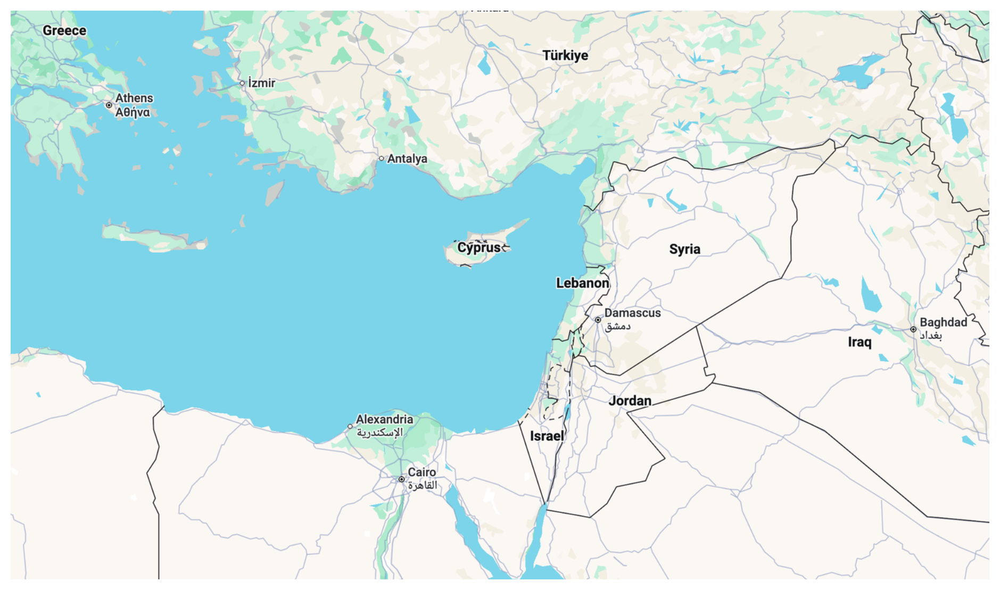

---

<!-- _class: lead -->

# <div class="green outline-white">Start simple</div>

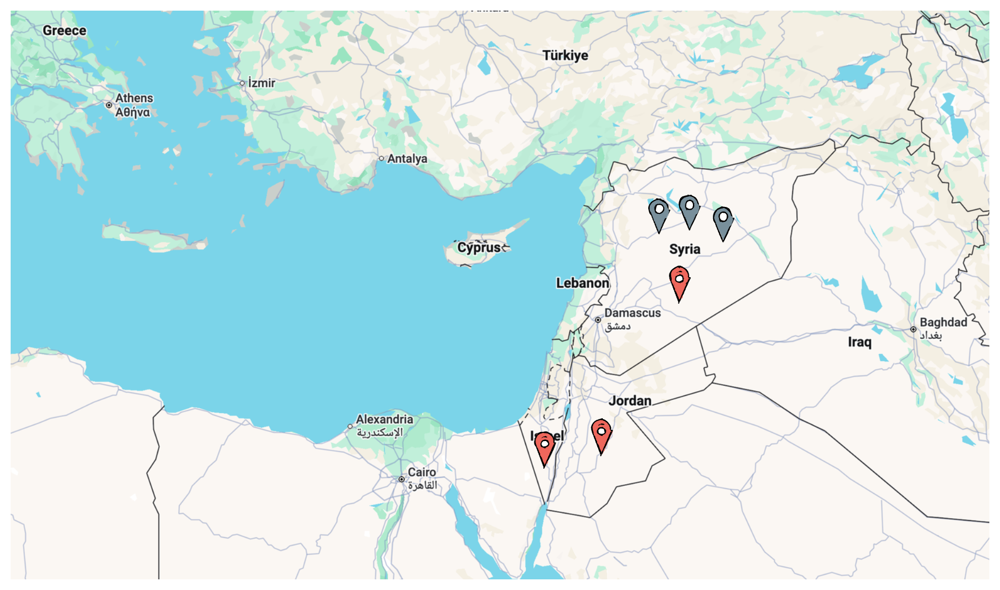

---

<!-- _class: lead -->

# <div class="blue outline-white">Cover every subdivision of the problem space</div>

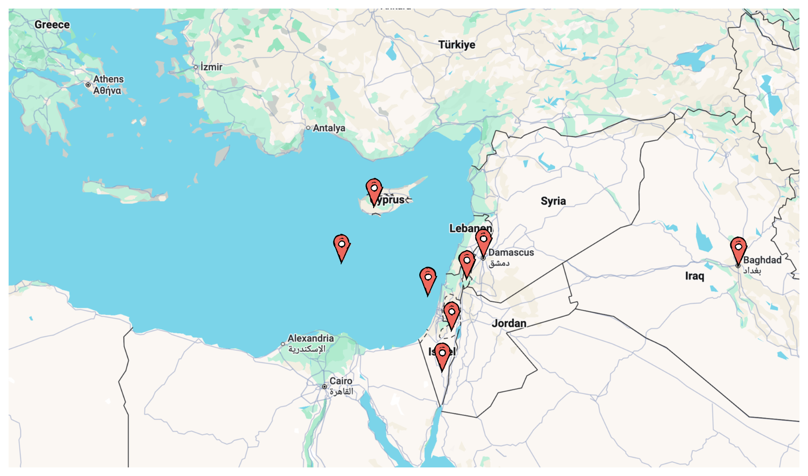

---

<!-- _class: lead -->

# <div class="yellow outline-white">There are surprising subdivisions</div>

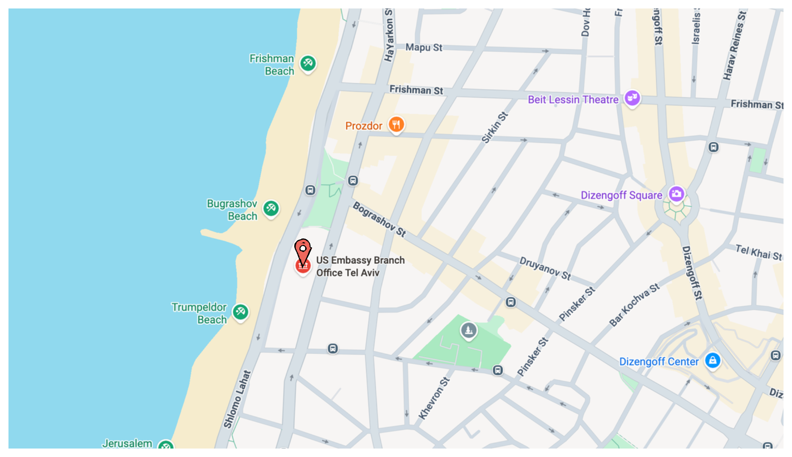

---

<!-- _class: lead -->

# <div class="black outline-white">Hug borders tightly</div>

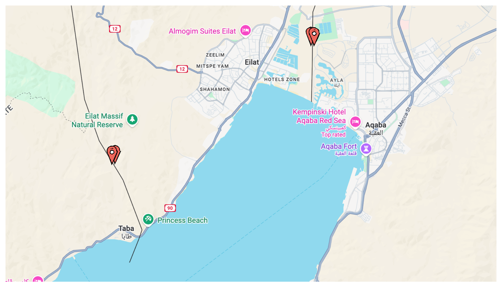

---

<!-- _class: lead -->

# <div class="red outline-white">Look for multipoints</div>

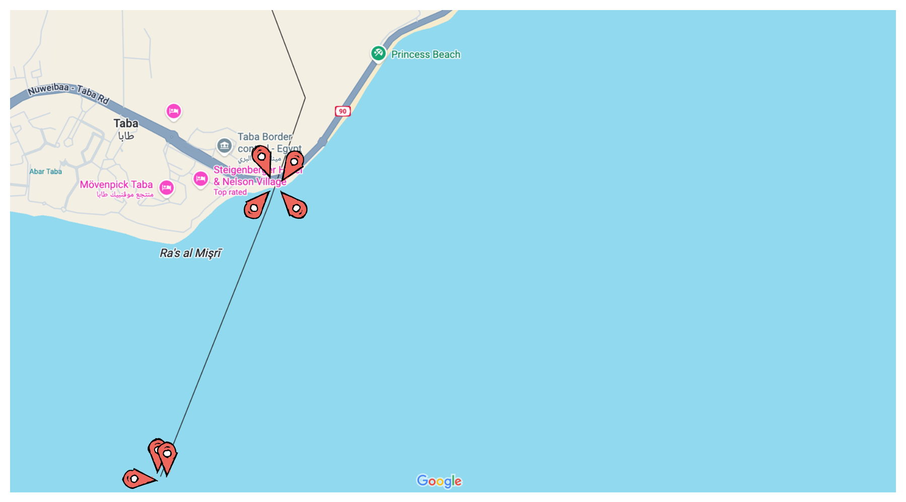

---

<!-- _class: lead -->

# <div class="outline-white">Again!</div>

```python
list(range(start=1, stop=10, step=3))  # => [1, 4, 7, 9]
```

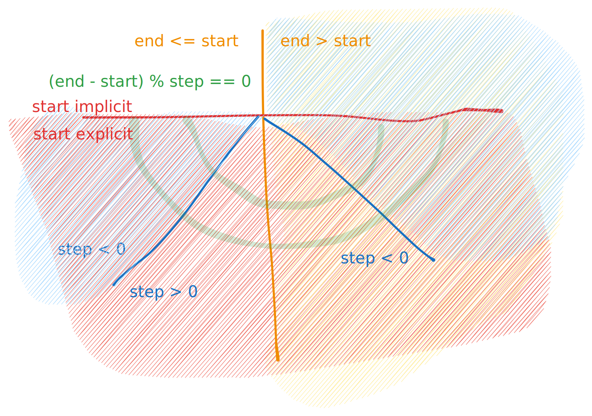

---

<!-- _class: lead -->

# <div class="green outline-white">Start simple</div>

<div class="flex">

```python
assert (
    list(range(3)) == list(range(0, 3)) ==
    list(range(0, 3, 1)) == [0, 1, 2]
)
assert list(range(1, 3)) == [1, 2]
assert list(range(1, 6, 2)) == [1, 3, 5]
assert list(range(5, 0, -1)) == [5, 4, 3, 2, 1]
```


</div>

---

<!-- _class: lead -->

# <div class="blue outline-white">Cover every subdivision of the problem space</div>

<div class="flex">

```python
assert (
    list(range(3)) == list(range(0, 3)) ==
    list(range(0, 3, 1)) == [0, 1, 2]
)
assert list(range(1, 3)) == [1, 2]
assert list(range(1, 6, 2)) == [1, 3, 5]
assert list(range(5, 0, -1)) == [5, 4, 3, 2, 1]
assert list(range(3, 1)) == []
assert list(range(5, 5, -1)) == []
assert list(range(5, 0, -2)) == [5, 3, 1]
```


</div>

---

<!-- _class: lead -->

# <div class="yellow outline-white">There are surprising subdivisions</div>

<div class="flex">

```python
assert (
    list(range(3)) == list(range(0, 3)) ==
    list(range(0, 3, 1)) == [0, 1, 2])
assert list(range(1, 3)) == [1, 2]
assert list(range(1, 6, 2)) == [1, 3, 5]
assert list(range(5, 0, -1)) == [5, 4, 3, 2, 1]
assert list(range(3, 1)) == []
assert list(range(5, 5, -1)) == []
assert list(range(5, 0, -2)) == [5, 3, 1]
assert list(range(3, 4, 2)) == [3]
assert list(range(-1)) == []
try:
    list(range(2.5))
    assert False
except TypeError: pass
try:
    list(range(0, 3, 0))
    assert False
except TypeError: pass
```


</div>

---

<!-- _class: lead -->

# <div class="black outline-white">Hug borders tightly</div>

<div class="flex">

```python
assert (list(range(3)) == list(range(0, 3)) ==
        list(range(0, 3, 1)) == [0, 1, 2])
assert list(range(2, 3)) == [2]
assert list(range(3, 3)) == []
assert list(range(3, 2)) == []
assert list(range(-1)) == []
assert list(range(1, 6, 2)) == [1, 3, 5]
assert list(range(1, 5, 2)) == [1, 3]
assert list(range(1, 4, 2)) == [1, 3]
assert list(range(1, 3, 2)) == [1]
assert list(range(5, 0, -1)) == [5, 4, 3, 2, 1]
assert list(range(5, 4, -1)) == [5]
assert list(range(5, 5, -1)) == []
assert list(range(5, 0, -2)) == [5, 3, 1]
assert list(range(5, 0, -4)) == [5, 1]
assert list(range(5, 0, -5)) == [5]
with pytest.raises(ValueError):
    list(range(5, 0, 0))
with pytest.raises(TypeError):
    list(range(2.5))
```


</div>

---

<!-- _class: lead -->

# <div class="red outline-white">Look for multipoints</div>

<div class="flex">

```python
range(1)
range(0, 1)
range(0, 1, 1)

range(0, 1, 0)
range(0, -1, -1)

range(0, 0, 1)
range(0, 0, 0)
range(0, 0, -1)

range(0, 2, 1)
range(0, 2, 0)
range(0, -2, -1)

# what else?
```


</div>

---

<!-- _class: lead -->

# Now lets write some great tests!

```python
# shekels.py

def amount_to_shekels_in_hebrew(amount):
    ...
assert amount_to_shekels_in_hebrew(1.01) == "שקל אחד ואגורה אחת"
# what else?

# bonus:
def normalize_shekel_string(string):
    ...
assert normalize_shekel_string("שנים עשר שמונים") == "שתים עשרה שקל ושמונים אגורות"
```

Who can find a bug? (I couldn't, but there's enough logic that there must be)

---

<!-- _class: lead -->

# Testing stateful systems

The <span class="red">state</span> is another dimension in the problem space

It gets ugly fast.

---

<!-- _class: lead -->

# Testing stateful systems

As much as you can, avoid writing stateful systems.

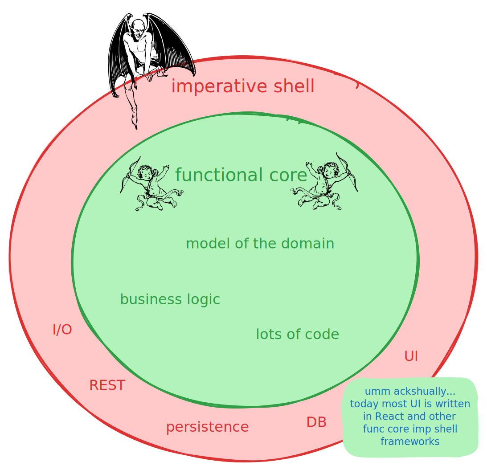

---


---

# Testing stateful systems

<style scoped>
section {
    background: url(assets/funcore-impshell.svg) 960px 510px no-repeat;
    background-color: white;
    background-size: 60%;
}
</style>

```python
user = create_account(name="Adam")
pizza = create_item(name="Pizza", price="$9.99")
add_to_shopping_cart(user, pizza, quantity=1)
shopping_cart = get_shopping_cart(user)
assert len(shopping_cart) == 1
(item,) = shopping_cart
assert item.id == pizza.id and item.quantity == 1
finalize_order(user, credit_card="XXXX-XXXX-XXXX-XXXX")
assert not get_shopping_cart(user)
```

How do we add more tests?

---

# Testing stateful systems

<style scoped>
section {
    background: url(assets/funcore-impshell.svg) 960px 510px no-repeat;
    background-color: white;
    background-size: 60%;
}
</style>

```python
user = create_account(name="Adam")
pizza = create_item(name="Pizza", price="$9.99")
add_to_shopping_cart(user, pizza, quantity=2)
(item,) = get_shopping_cart(user)
assert item.id == pizza.id and item.quantity == 2
remove_from_shopping_cart(user, pizza, quantity=1)
(item,) = get_shopping_cart(user)
assert item.id == pizza.id and item.quantity == 1
finalize_order(user, credit_card="XXXX-XXXX-XXXX-XXXX")
assert not get_shopping_cart(user)
```

We had stateful code. We tested it with a stateful test.
<span class="red">Now we have two problems</span>.
It's very hard to <span class="red">add nother case without breaking</span> anything
or to <span class="red">figure out why it failed</span>.

---

# Lets try again.

<style scoped>
section {
    background: url(assets/funcore-impshell.svg) 960px 510px no-repeat;
    background-color: white;
    background-size: 60%;
}
</style>

```python
user = create_account(name="Adam")
pizza = create_item(name="Pizza", price="$9.99")
add_to_shopping_cart(user, pizza, quantity=2)
(item,) = get_shopping_cart(user)
assert item.id == pizza.id and item.quantity == 2

user = create_account(name="Adam")
pizza = create_item(name="Pizza", price="$9.99")
add_to_shopping_cart(user, pizza, quantity=2)
remove_from_shopping_cart(user, pizza, quantity=1)
(item,) = get_shopping_cart(user)
assert item.id == pizza.id and item.quantity == 1
                                                                                                            
user = create_account(name="Adam")
pizza = create_item(name="Pizza", price="$9.99")
add_to_shopping_cart(user, pizza, quantity=2)
remove_from_shopping_cart(user, pizza, quantity=1)
finalize_order(user, credit_card="XXXX-XXXX-XXXX-XXXX")
assert not get_shopping_cart(user)
```

We managed to hide the devil, but he still lurks.
This is <span class="red">slow</span>, and test speed is essential to happy, effective devs.
It's also repetitive, so <span class="red">mistakes</span> won't be noticed (I made one).

---

# Again.

<style scoped>
section {
    background: url(assets/funcore-impshell.svg) 960px 510px no-repeat;
    background-color: white;
    background-size: 60%;
}
</style>

```python
def setup_pizza_test(quantity=1):
    user = create_account(name="Adam")
    pizza = create_item(name="Pizza", price="$9.99")
    add_to_shopping_cart(user, pizza, quantity=quantity)
    (item,) = get_shopping_cart(user)    
    return user, pizza, item

user, pizza, item = setup_pizza_test()
assert item.id == pizza.id and item.quantity == 2

user, pizza, item = setup_pizza_test(quantity=2)
remove_from_shopping_cart(user, pizza, quantity=1)
(item,) = get_shopping_cart(user)
assert item.id == pizza.id and item.quantity == 1
                                                                                                            
user, pizza, item = setup_pizza_test(quantity=1)
finalize_order(user, credit_card="XXXX-XXXX-XXXX-XXXX")
assert not get_shopping_cart(user)
```

Who put <span class="yellow">spaghetti</span> in my pizza test? `setup()` tends to grow wild.

Still, this is usually the winning tradeoff. Unless we can make the
business logic <span class="green">stateless</span>...

---

<!-- _class: lead -->

## A message from the Devil:

# Even if you split your test cases between several `test_*()` functions, feel free to make assumptions about the order in which they run. Hehe. Hehehehe.

<br/>
<br/>
<br/>
<br/>
<br/>

<style scoped>
section {
    background: url(assets/funcore-impshell.svg) 700px 360px no-repeat;
    background-color: white;
    background-size: 100%;
}
</style>

---

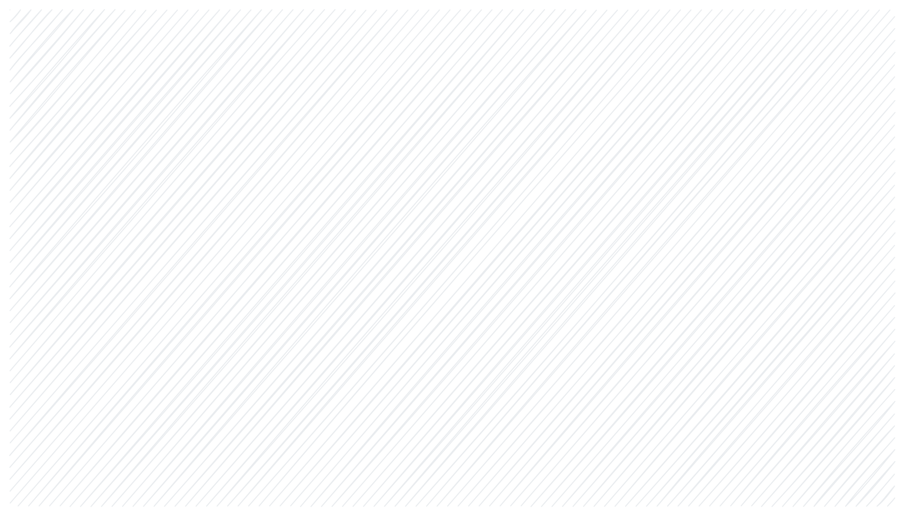

## Testing toolbox

Given...When...Then

Setup/Teardown/Fixtures

Parametrize

Mocks

---

It's standard to write tests with this structure:

## Given...When...Then

```python
def test_finalize_order_empties_shopping_cart():
    # Given: a user's shopping cart with one pizza
    user = create_account(name="Adam")
    pizza = create_item(name="Pizza", price="$9.99")
    add_to_shopping_cart(user, pizza, quantity=quantity)

    # When: I finalize the order
    finalize_order(user, credit_card="XXXX-XXXX-XXXX-XXXX")

    # Then: The shopping cart is now empty
    shopping_cart = get_shopping_cart(user)
    assert not shopping_cart
```

Google's testing book calls this DAMP tests, meaning each test is a "Descriptive And Meaningful Phrase" and <span class="yellow">not DRY</span> (tests repeat themselves!).

---

# DRY or DAMP?

Should you optimize for <span class="grape">maintainability and ease of writing tests</span> or for <span class="yellow">ease of reading a single test in isolation</span>?

Accepted wisdom is <span class="yellow">the latter</span>, I advise to <span class="green">try to strike a good balance</span>.

<span class="yellow">If you have 100 test</span> like "<span class="cyan">add some standard items to the shop, create a user, do a series of adds/removes on their shopping cart, check what's in the shopping cart</span>", you can afford to write a <span class="green">test harness</span>. If you only have 5 and they're not super identical, <span class="yellow">just copy paste</span>.

---

## Setup/Teardown/Fixtures

Traditional xUnit test frameworks have a hierarchy of `setup()`/`teardown()` hooks (for _tests_ and _test suites_).

`pytest` improves on it with `fixtures`, a _dependency injection_ mechanism for resources used by tests.

---

### Fixtures

```python
import pytest

@pytest.fixture
def shop(scope="session"):  # runs once before first test
    pizza = create_item(name="Pizza", price="$9.99")
@pytest.fixture
def user():
    user = create_account(name="Adam")
    yield user
    close_account(user)  # you can teardown resources
@pytest.fixture
def cart_item(shop, user):  # fixtures can depend on other fixtures
    add_to_shopping_cart(user, pizza, quantity=1)
    (item,) = get_shopping_cart(user)
    yield item

def test_finalize_order_empties_shopping_cart(user, cart_item):                         
    finalize_order(user, credit_card="XXXX-XXXX-XXXX-XXXX")
    shopping_cart = get_shopping_cart(user)
    assert not shopping_cart
```

---

## Parametrization

The poor man's _test harness_, good enough in 80% of cases.

```python
@pytest.mark.parametrize(
    "amount,hebrew",
    [
        (1, "שקל אחד"),
        (2, "שני שקלים"),
        (10, "עשרה שקלים"),
        # ...
        # Decimal tests
        (1.23, "שקל אחד ועשרים ושלוש אגורות"),
        # ...
        # Error cases
        (None, ""),
        ("א", "לא הוקש סכום תקין"),
        (1222333444555, "לא הוקש סכום תקין"),                                         
    ],
)
def test_conversion(amount, hebrew):
    assert amount_to_shekels_in_hebrew(amount) == hebrew
```

---

## Mocks

Should we actually talk to the credit card processor when testing "finalizing an order"? <span class="green">Probably not</span>. And to the DB?

Python has <span class="grape">_absolutely magical_</span> libaries for saying "this test believes as dogma that this other code behaves as follows", from "<span class="cyan">make the system clock always say midnight</span>" to "<span class="teal">when sending a POST request to `stripe.com/api/charge`, it will return HTTP 405 the first time and this JSON document the second time, also assert it was called with the right params</span>".

---

## `MagicMock` and `patch`

```python
from unittest.mock import MagicMock, patch

def test_finalize_order_empties_shopping_cart(user, cart_item):
    _pay(user)
    shopping_cart = get_shopping_cart(user)
    assert not shopping_cart

@patch("time.time", return_value=12345)
@patch("requests.post")
def _pay(mock_time, mock_post, user):
    mock_post.return_value.json.return_value = {"id": "123"}

    order = get_order_summary(user)
    assert mock_post.assert_called_once_with("https://.../api/initiate", json={...})

    mock_post.reset_mock()
    payment = initiate_payment(order)
    receive_payment_success(order, {"payment_id": "123", "token": "123"})
    assert mock_post.assert_called_once_with("https://.../api/validate", json={...})
```

---

<!-- _class: lead -->

## VCR

```python
import vcr

def test_finalize_order_empties_shopping_cart(user, cart_item):
    _pay(user)
    shopping_cart = get_shopping_cart(user)
    assert not shopping_cart

with vcr.use_cassette('fixtures/vcr_cassettes/payment.yaml'):
def _pay(user):
    order = get_order_summary(user)
    payment = initiate_payment(order)
    receive_payment_success(order, {"payment_id": "123", "token": "123"})
```

---

<!-- _class: lead -->

## `pip install vcrpy` works for HTTP, but you can easily implement your own VCR for anything

---

<!-- _class: lead -->

<div class="flex">

# What should we mock?

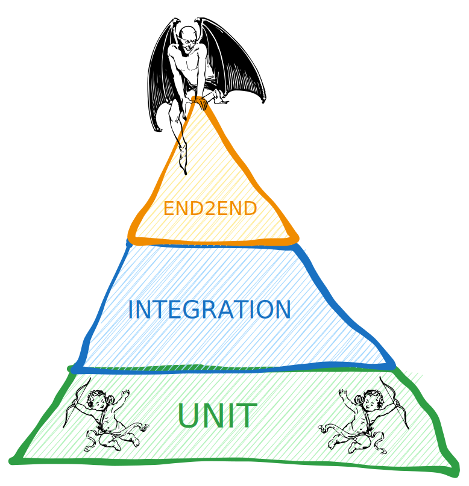

</div>

---

<!-- _class: lead -->

<div class="flex">

<div>

# What should we mock?

Still, in a web app we should probably not mock the DB.

But our ORM can, with SQLite!

</div>


</div>

---

<!-- _class: lead -->

# Let's look at some tests!

[The `warehouse` (PyPI) tests](https://github.com/pypi/warehouse/tree/main/tests). Look at their [session tests](https://github.com/pypi/warehouse/blob/main/tests/unit/test_sessions.py). <span class="green">What's their stance on "test one thing per test"?</span>

[The `httpx` HTTP client tests](https://github.com/encode/httpx/tree/master/tests). Fixtures are in `conftest.py`. Find the `GET /` test. Find test for JSON encode/decode. <span class="green">What did they choose to mock?</div>

[The SQLAlchemy (database ORM) tests](https://github.com/sqlalchemy/sqlalchemy/tree/main/test). Find the tests that together say "`SELECT field FROM table` does what we want". <span class="green">Where are they on DRY/DAMP question?</span>

Which test suite did you like the most? Why?

---

<!-- _class: lead -->

# Lets design tests!

## How would you test `glob.glob`?

https://docs.python.org/3/library/glob.html

### Write a full suite of test cases in pseudo-code

## How would you test the ChatGPT backend?

(the consumer app, _not_ the GPT API, which is one of your dependencies)

### Write some example test cases in pseudo-code

---


## <span class="green">Intro</span> Who, Why, What

## <span class="green">I</span> xUnit tests

## <span class="green">II</span> Evaluating prompts

#### Let's use an LLM to process a request

#### How to think about "correctness"

#### Train/test split

#### Quality measures

#### Production monitoring

## <span class="green">III</span> Mastery

---

<!-- _class: lead -->

# Let's use an LLM to process a request

```python
from pydantic import BaseModel, Field
from pydantic_ai import Agent

class PalindromeGeneration(BaseModel):
    palindrome: str = Field(description="The generated palindrome")

generator_agent = Agent(
    model="google-gla:gemini-2.0-flash-lite",
    output_type=PalindromeGeneration,
    system_prompt="""You are a creative palindrome generator. Create palindromes that:
1. Are related to the given topic
2. Make grammatical and semantic sense
""",
)
def generate_palindrome(topic):
    prompt = f"Create a palindrome related to the topic: {topic}"
    return generator_agent.run_sync(prompt).output
```

How do we test <span class="red">non-deterministic</span> outputs?

---

# Traditional test won't work

```python
def test_palindrome():
    topic = "quest for the holy grail"
    result = generate_palindrome(topic)

    # This might fail randomly!
    assert result.palindrome == "Sir, a Grail, a liar, Garis!"
```

---

<!-- _class: lead -->

# What is a "correct" answer?

## <span class="grape">Signal + Noise</span> -> <span class="green">[Our Test]</span> -> <span class="grape">Signal + Noise


---


## Quality measures

Deterministic measurements

Accuracy curves

Human as judge

LLM as judge

Ensemble

---

<!-- _class: lead -->

## Noisy Metrics

```python
import numpy as np
agent = Agent(OpenAIModel("gemini-embedding-001"))

def embedding_correlation(a, b):
    e_a, e_b = agent.run_sync(a), agent.run_sync(b)
    correlation = np.dot(e_a, e_b) / (
        np.linalg.norm(e_a) * np.linalg.norm(e_b))
    return correlation

correlation = embedding_correlation(
    "quest for the holy grail",
    "Sir, a Grail, a liar, Garis!"
)
```

---

<!-- _class: lead -->

## Deterministic measurements

```python
def is_palindrome(text: str) -> bool:
    cleaned = re.sub(r"[^a-zA-Z0-9]", "", text.lower())
    return cleaned == cleaned[::-1]
```

---

<div class="flex">

## Accuracy curves

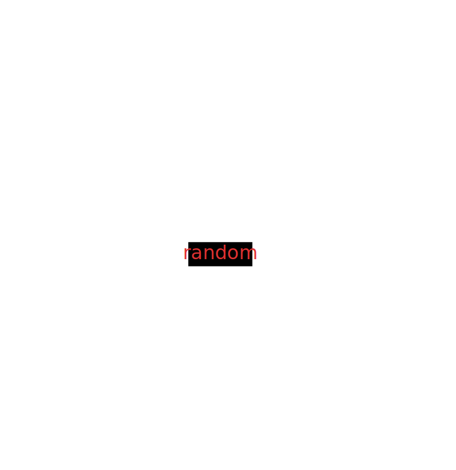

</div>

---

<!-- _class: lead -->

## Human as judge 😩

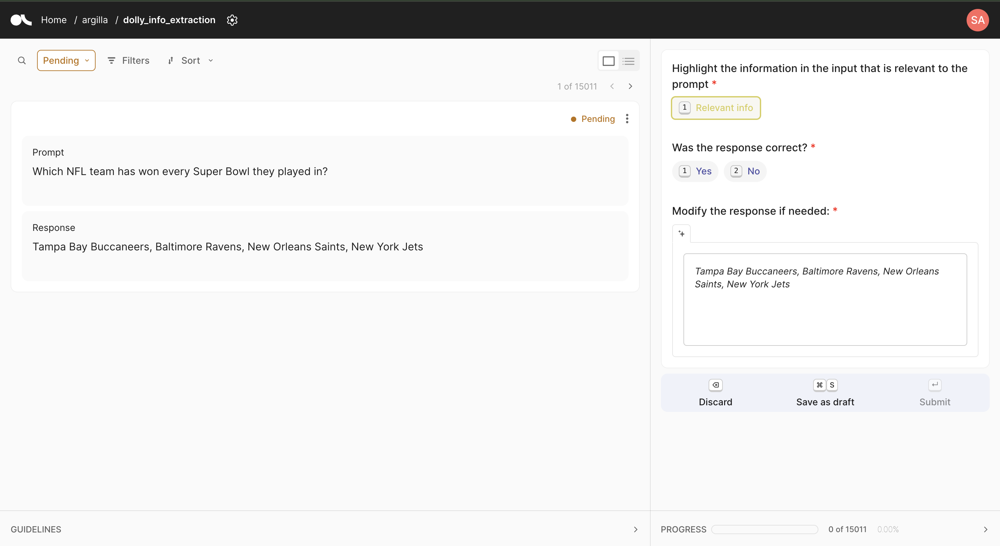

---

<!-- _class: lead -->

## LLM as judge

```python
class PalindromeEvaluation(BaseModel):
    sense_score: int = Field(description="How much sense it makes (1-10)", ge=1, le=10)
    topic_score: int = Field(description="How on topic it is (1-10)", ge=1, le=10)

evaluator_agent = Agent(
    model="google-gla:gemini-2.0-flash-lite",
    output_type=PalindromeEvaluation,
    system_prompt="""You are a creative writing teacher. Evaluate this short text on:

1. Sense (1-10): How grammatically correct and semantically meaningful is it?
2. Topic relevance (1-10): How well does it relate to the assigned topic?
""",
)
```

---

<!-- _class: lead -->

## Ensemble

```python
generation = generate_palindrome(topic)
evaluation = evaluate_palindrome(topic, generation.palindrome)
is_valid_palindrome = is_palindrome(generation.palindrome)
palindrome_score = 10 * is_valid_palindrome
average_score = (
    palindrome_score + evaluation.sense_score + evaluation.topic_score
) / 3
```

---

<!-- _class: lead -->

# Train/test split

```python
all_examples = load_examples()
random.shuffle(all_examples)

# 80/20 split
train_set = all_examples[:800]  # For prompt engineering
test_set = all_examples[800:]   # For evaluation

# Use train_set to iterate on your prompt
# Use test_set ONCE to measure final quality
```

<span class="red">Never</span> look at test set results until you're done!

### Remember: if you already know the answer, it's fake science

---

<!-- _class: lead -->

# Production monitoring

## <span class="green">Log everything</span>

## Track quality metrics over time

## A/B test prompt changes

## Monitor for drift

---

<!-- _class: lead -->

# It's science time!

```
cp .env.example .env
# make  free logfire and google ai studio accounts
# put API keys in .env
uv run logfire auth
uv run python palindrome.py train
```

## Exercise: design a prompt to maximize `average_score`

---


## <span class="green">II</span> Evaluating prompts

## <span class="green">III</span> Mastery

TDD

Coverage

Things that are hard to test

BDD & FIT

Golden/snapshot testing

Design exercise

<span class="yellow">Blesstests</span>

---

<!-- _class: lead -->

# <span class="red">T</span><span class="green">D</span><span class="blue">D</span>

## Test Driven Development

<span class="red">Red (failing test)</span>
<span class="green">Green (minimal change that fixes it)</span>
<span class="blue">Refactor (if needed)</span>
<span class="grape">Repeat.</span>

---

<!-- _class: lead -->

## TDD is actually not about tests, it's about design.

But it's a good way to practice testing. Lets build FizzBuzz with TDD.

```python
def fizzbuzz(n):
    pass
assert fizzbuzz(1) == "1"

# what's the minimal fix to make it green?
```

Try it for a week. I myself do pseudo-TDD. I write pseudocode for tests before the first line of code, so my design will be testable.

---

# Coverage metrics

```bash
$ pytest --cov=myproject tests/
======================== test session starts ========================
tests/test_shekels.py::test_simple_amounts PASSED
tests/test_shekels.py::test_edge_cases PASSED
tests/test_shekels.py::test_large_numbers PASSED

---------- coverage: platform linux, python 3.11.0 ----------
Name                  Stmts   Miss  Cover
-----------------------------------------
myproject/shekels.py     45      3    93%
myproject/utils.py       20      0   100%
-----------------------------------------
TOTAL                    65      3    95%
```

<span class="green">100% coverage ≠ bug-free</span>
Coverage shows what you <span class="red">didn't</span> test

---

<!-- _class: lead -->

# Things that are hard to test

### <span class="red">UI</span> - Automated visuals tests probably not worth the effort

### <span class="red">Nondeterministic code</span> - Duh. Wait, why are you writing it?

### <span class="red">Distributed code</span> - Oof. Good luck. Read some [jepsen](https://aphyr.com/posts/284-jepsen-mongodb) posts.

---

<!-- _class: lead -->

# BDD (Behavior-Driven Development)

## Tests are <span class="green">executable specifications</span>

```gherkin
Scenario: Counting people in departments
  Given a set of specific users
     | name      | department  |
     | Barry     | Arguments   |
     | Pudey     | Silly Walks |
     | Two-Lumps | Silly Walks |

 When we count the number of people in each department
 Then we will find two people in "Silly Walks"
  But we will find one person in "Arguments"
```

---

<!-- _class: lead -->

# BDD implementation

```python
from behave import given, when, then

@given("a set of specific users")
def step_impl(context):
    for row in context.table:
        model.add_user(name=row["name"], department=row["department"])

@when("we count the number of people in each department")
def step_impl(context):
    context.department_counts = model.count_by_department()

@then('we will find {count:d} (?:person|people) in "{department}"')
def step_impl(context, count, department):
    actual_count = context.department_counts.get(department, 0)
    assert actual_count == count, f"Expected {count} people in {department}, but found {actual_count}"
```

<span class="green">Product managers can write tests!</span>
<span class="red">I think it's enough that they can write test cases and read test reports</span>

---

# FIT (Framework for Integrated Test)

A dialect of BDD that uses Excel (FIT) or a wiki (FitNesse) to write tables of test case parameters.

---

<!-- _class: lead -->

# Golden/Snapshot testing

```python
def test_render_invoice():
    assert range(1) == snapshot()
    assert range(0, 1) == snapshot()
    assert range(0, 1, 1) == snapshot()

    assert range(0, 1, 0) == snapshot()
    assert range(0, -1, -1) == snapshot()

    assert range(0, 0, 1) == snapshot()
    assert range(0, 0, 0) == snapshot()
    assert range(0, 0, -1) == snapshot()

    assert range(0, 2, 1) == snapshot()
    assert range(0, 2, 0) == snapshot()
    assert range(0, -2, -1) == snapshot()
```

Run it and it becomes...

---

# Golden/Snapshot testing

```python
def test_render_invoice():
from inline_snapshot import snapshot
from inline_snapshot.extra import raises


def test_range():
    assert range(1) == snapshot(range(0, 1))
    assert range(0, 1) == snapshot(range(0, 1))
    assert range(0, 1, 1) == snapshot(range(0, 1))

    with raises(snapshot("ValueError: range() arg 3 must not be zero")):
        range(0, 1, 0)
    assert range(0, -1, -1) == snapshot(range(0, -1, -1))
    # ...
```

---

## Golden tests meet world

## <span class="green">Benefits</span>

- Catches <span class="blue">unexpected changes</span>
- Very low friction to add tests
- Great for complex outputs (HTML, reports, tables, generated code)

## <span class="red">Pitfalls</span>

- Tests become <span class="red">change detectors</span> (also <span class="green">yay</span>!)
- Need to think while running tests (also <span class="green">yay</span>!)
- Non-deterministic data (timestamps, IDs) needs to be normalized
- Higher friction to touch mature project (reflects reality... but <span class="red">must-fix</span>)

---

<!-- _class: lead -->

# Design exercise: Testing a chatbot

You're building a 0% AI, 100% scripted sales chatbot

## How would you test it?

---

```yaml
- import test_default_init_album
- לבחירת אלבום בינוני
- B: אנא כתבו את הכתובת אליה נשלח אליכם את האלבום
- B: מה שם העיר?
- גבעתיים
- B: מה שם הרחוב? (בלי מספר)
- שינקין
- B: מה מספר הבניין/בית?
- "1"
- B: מה מספר המיקוד?
- "1231234"
- B: |-
    *סיכום פרטי האלבום עד כה:*
    *שם + שם משפחה:* טסט בוט
    *כתובת מייל:* test@albooms.co.il
    *שם האירוע שיופיע על כריכת האלבום:* בדיקה אוטומטית
    *גודל האלבום הנבחר:* בינוני - 20X54
    *כתובת למשלוח:* גבעתיים, שינקין 1, דירה: 2, מיקוד: 1231234
  buttons:
    - אישור
    - עריכה
- אישור
```

---

<!-- _class: lead -->

<style scoped>
.magic span {
    display: inline-block;
    font-size: 1.2em;
    background-image: linear-gradient(45deg, #6930c3, #ffd21fff);
    background-clip: text;
    -webkit-text-fill-color: transparent;

    &:nth-child(1) {
        animation-delay: 0s;
    }
    &:nth-child(2) {
        animation-delay: 0.2s;
    }
    &:nth-child(3) {
        animation-delay: 0.4s;
    }
    &:nth-child(4) {
        animation-delay: 0.6s;
    }
    &:nth-child(5) {
        animation-delay: 0.8s;
    }
    animation: wave 2s ease-in-out infinite;
}

@keyframes wave {
    0%, 100% {
        transform: translateY(10px);
    }
    50% {
        transform: translateY(-10px);
    }
}
</style>

# <span class="yellow">Blesstests</span>

https://github.com/SonOfLilit/blesstest/tree/main
https://github.com/SonOfLilit/todont/blob/main/test_todont.py
https://github.com/SonOfLilit/rps/blob/main/tests.py

## <span class="violet">Snapshots + Git + DSLs + Variation trees = <span class="magic"><span>M</span><span>A</span><span>G</span><span>I</span><span>C</span></span></span>

---

# Final Exam

Design a test suite for your largest work project that would minimize the friction of adding test cases.

---

<!-- _class: lead -->

# Key takeaways

## Testing is <span class="green">risk management</span>

## Choose test cases <span class="blue">systematically</span>

## Different problems need <span class="grape">different approaches</span>

## Minimize <span class="red">friction</span> to add test cases

---

<!-- _class: lead -->

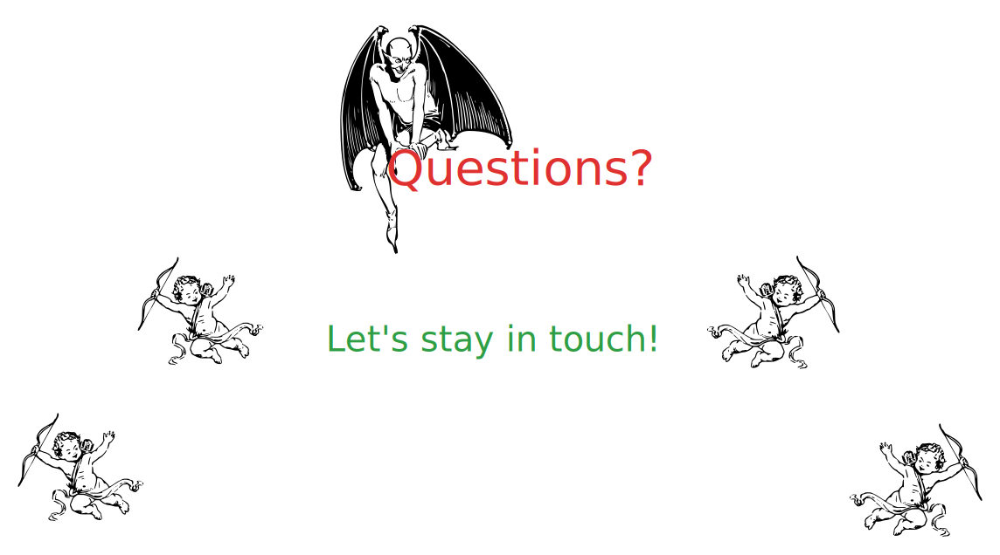

aur@sarafconsulting.com

<style>
    @font-face {
        font-family: 'Excalifont';
        src: url('https://excalidraw.nyc3.cdn.digitaloceanspaces.com/fonts/Excalifont-Regular.woff2') format('woff2');
        font-weight: 400;
        font-style: normal;
        font-display: swap;
    }

    section .outline-white, section[data-class="outline-white"] {
        text-shadow: -1px -1px 0 white, 1px -1px 0 white, -1px 1px 0 white, 1px 1px 0 white;
    }

    section {
        font-family: 'Excalifont';
        background: white;
        color: var(--oc-blue-6);

        &:where(.lead) {
            place-content: safe center center;

            /* Definitions for classic bhavior: Users can adopt flex centering by tweaking style `section.lead { display: flex }` */
            flex-flow: column nowrap;
            align-items: stretch;

            h1,
            h2,
            h3,
            h4,
            h5,
            h6 {
            text-align: center;
            }

            /* stylelint-disable-next-line no-descending-specificity */
            p {
            text-align: center;
            }

            blockquote {
            > h1,
            > h2,
            > h3,
            > h4,
            > h5,
            > h6,
            > p {
                text-align: left;
            }
            }

            ul,
            ol {
            > li > p {
                text-align: left;
            }
            }

            table {
            margin-left: auto;
            margin-right: auto;
            }
        }
    }

    h1 {
        color: var(--oc-red-6);
    }
    h2 {
        color: var(--oc-yellow-6);
    }
    h3 {
        color: var(--oc-grape-6);
    }
    a[href] {
        text-decoration: underline;
    }
    p {
    }
    ul li {
        list-style-type: none;
    }
    ul li h2:before {
        content: "*";
        float: left;
        padding-right: .3em;
    }
    .small {
        font-size: .8em;
        color: var(--oc-orange-6);
    };
    .red {
        color: var(--oc-red-6);
    }
    .blue {
        color: var(--oc-blue-6);
    }
    .green {
        color: var(--oc-green-6);
    }
    .yellow {
        color: var(--oc-yellow-6);
    }
    .orange {
        color: var(--oc-orange-6);
    }
    .cyan {
        color: var(--oc-cyan-6);
    }
    .teal {
        color: var(--oc-teal-6);
    }
    .violet {
        color: var(--oc-violet-6);
    }
    .grape {
        color: var(--oc-grape-6);
    }
    .black {
        color: var(--oc-black);
    }
    .white {
        color: var(--oc-white-6);
    }

    .flex {
        display: flex;
        flex-direction: row;
        align-items: center;
        gap: 50px;
    }
    .flex > * {
        flex-basis: 100%;
    }

    /*
    *
    *  𝗖 𝗢 𝗟 𝗢 𝗥
    *  v 1.9.1
    *
    *  ━━━━━━━━━━━━━━━━━━━━━━━━━━━━━━━━━━━ */

    :root {

    /*  General
    *  ─────────────────────────────────── */

    --oc-white: #ffffff;
    --oc-white-rgb: 255, 255, 255;
    --oc-black: #000000;
    --oc-black-rgb: 0, 0, 0;


    /*  Gray
    *  ─────────────────────────────────── */

    --oc-gray-0: #f8f9fa;
    --oc-gray-0-rgb: 248, 249, 250;
    --oc-gray-1: #f1f3f5;
    --oc-gray-1-rgb: 241, 243, 245;
    --oc-gray-2: #e9ecef;
    --oc-gray-2-rgb: 233, 236, 239;
    --oc-gray-3: #dee2e6;
    --oc-gray-3-rgb: 222, 226, 230;
    --oc-gray-4: #ced4da;
    --oc-gray-4-rgb: 206, 212, 218;
    --oc-gray-5: #adb5bd;
    --oc-gray-5-rgb: 173, 181, 189;
    --oc-gray-6: #868e96;
    --oc-gray-6-rgb: 134, 142, 150;
    --oc-gray-7: #495057;
    --oc-gray-7-rgb: 73, 80, 87;
    --oc-gray-8: #343a40;
    --oc-gray-8-rgb: 52, 58, 64;
    --oc-gray-9: #212529;
    --oc-gray-9-rgb: 33, 37, 41;


    /*  Red
    *  ─────────────────────────────────── */

    --oc-red-0: #fff5f5;
    --oc-red-0-rgb: 255, 245, 245;
    --oc-red-1: #ffe3e3;
    --oc-red-1-rgb: 255, 227, 227;
    --oc-red-2: #ffc9c9;
    --oc-red-2-rgb: 255, 201, 201;
    --oc-red-3: #ffa8a8;
    --oc-red-3-rgb: 255, 168, 168;
    --oc-red-4: #ff8787;
    --oc-red-4-rgb: 255, 135, 135;
    --oc-red-5: #ff6b6b;
    --oc-red-5-rgb: 255, 107, 107;
    --oc-red-6: #fa5252;
    --oc-red-6-rgb: 250, 82, 82;
    --oc-red-7: #f03e3e;
    --oc-red-7-rgb: 240, 62, 62;
    --oc-red-8: #e03131;
    --oc-red-8-rgb: 224, 49, 49;
    --oc-red-9: #c92a2a;
    --oc-red-9-rgb: 201, 42, 42;


    /*  Pink
    *  ─────────────────────────────────── */

    --oc-pink-0: #fff0f6;
    --oc-pink-0-rgb: 255, 240, 246;
    --oc-pink-1: #ffdeeb;
    --oc-pink-1-rgb: 255, 222, 235;
    --oc-pink-2: #fcc2d7;
    --oc-pink-2-rgb: 252, 194, 215;
    --oc-pink-3: #faa2c1;
    --oc-pink-3-rgb: 250, 162, 193;
    --oc-pink-4: #f783ac;
    --oc-pink-4-rgb: 247, 131, 172;
    --oc-pink-5: #f06595;
    --oc-pink-5-rgb: 240, 101, 149;
    --oc-pink-6: #e64980;
    --oc-pink-6-rgb: 230, 73, 128;
    --oc-pink-7: #d6336c;
    --oc-pink-7-rgb: 214, 51, 108;
    --oc-pink-8: #c2255c;
    --oc-pink-8-rgb: 194, 37, 92;
    --oc-pink-9: #a61e4d;
    --oc-pink-9-rgb: 166, 30, 77;


    /*  Grape
    *  ─────────────────────────────────── */

    --oc-grape-0: #f8f0fc;
    --oc-grape-0-rgb: 248, 240, 252;
    --oc-grape-1: #f3d9fa;
    --oc-grape-1-rgb: 243, 217, 250;
    --oc-grape-2: #eebefa;
    --oc-grape-2-rgb: 238, 190, 250;
    --oc-grape-3: #e599f7;
    --oc-grape-3-rgb: 229, 153, 247;
    --oc-grape-4: #da77f2;
    --oc-grape-4-rgb: 218, 119, 242;
    --oc-grape-5: #cc5de8;
    --oc-grape-5-rgb: 204, 93, 232;
    --oc-grape-6: #be4bdb;
    --oc-grape-6-rgb: 190, 75, 219;
    --oc-grape-7: #ae3ec9;
    --oc-grape-7-rgb: 174, 62, 201;
    --oc-grape-8: #9c36b5;
    --oc-grape-8-rgb: 156, 54, 181;
    --oc-grape-9: #862e9c;
    --oc-grape-9-rgb: 134, 46, 156;


    /*  Violet
    *  ─────────────────────────────────── */

    --oc-violet-0: #f3f0ff;
    --oc-violet-0-rgb: 243, 240, 255;
    --oc-violet-1: #e5dbff;
    --oc-violet-1-rgb: 229, 219, 255;
    --oc-violet-2: #d0bfff;
    --oc-violet-2-rgb: 208, 191, 255;
    --oc-violet-3: #b197fc;
    --oc-violet-3-rgb: 177, 151, 252;
    --oc-violet-4: #9775fa;
    --oc-violet-4-rgb: 151, 117, 250;
    --oc-violet-5: #845ef7;
    --oc-violet-5-rgb: 132, 94, 247;
    --oc-violet-6: #7950f2;
    --oc-violet-6-rgb: 121, 80, 242;
    --oc-violet-7: #7048e8;
    --oc-violet-7-rgb: 112, 72, 232;
    --oc-violet-8: #6741d9;
    --oc-violet-8-rgb: 103, 65, 217;
    --oc-violet-9: #5f3dc4;
    --oc-violet-9-rgb: 95, 61, 196;


    /*  Indigo
    *  ─────────────────────────────────── */

    --oc-indigo-0: #edf2ff;
    --oc-indigo-0-rgb: 237, 242, 255;
    --oc-indigo-1: #dbe4ff;
    --oc-indigo-1-rgb: 219, 228, 255;
    --oc-indigo-2: #bac8ff;
    --oc-indigo-2-rgb: 186, 200, 255;
    --oc-indigo-3: #91a7ff;
    --oc-indigo-3-rgb: 145, 167, 255;
    --oc-indigo-4: #748ffc;
    --oc-indigo-4-rgb: 116, 143, 252;
    --oc-indigo-5: #5c7cfa;
    --oc-indigo-5-rgb: 92, 124, 250;
    --oc-indigo-6: #4c6ef5;
    --oc-indigo-6-rgb: 76, 110, 245;
    --oc-indigo-7: #4263eb;
    --oc-indigo-7-rgb: 66, 99, 235;
    --oc-indigo-8: #3b5bdb;
    --oc-indigo-8-rgb: 59, 91, 219;
    --oc-indigo-9: #364fc7;
    --oc-indigo-9-rgb: 54, 79, 199;


    /*  Blue
    *  ─────────────────────────────────── */

    --oc-blue-0: #e7f5ff;
    --oc-blue-0-rgb: 231, 245, 255;
    --oc-blue-1: #d0ebff;
    --oc-blue-1-rgb: 208, 235, 255;
    --oc-blue-2: #a5d8ff;
    --oc-blue-2-rgb: 165, 216, 255;
    --oc-blue-3: #74c0fc;
    --oc-blue-3-rgb: 116, 192, 252;
    --oc-blue-4: #4dabf7;
    --oc-blue-4-rgb: 77, 171, 247;
    --oc-blue-5: #339af0;
    --oc-blue-5-rgb: 51, 154, 240;
    --oc-blue-6: #228be6;
    --oc-blue-6-rgb: 34, 139, 230;
    --oc-blue-7: #1c7ed6;
    --oc-blue-7-rgb: 28, 126, 214;
    --oc-blue-8: #1971c2;
    --oc-blue-8-rgb: 25, 113, 194;
    --oc-blue-9: #1864ab;
    --oc-blue-9-rgb: 24, 100, 171;


    /*  Cyan
    *  ─────────────────────────────────── */

    --oc-cyan-0: #e3fafc;
    --oc-cyan-0-rgb: 227, 250, 252;
    --oc-cyan-1: #c5f6fa;
    --oc-cyan-1-rgb: 197, 246, 250;
    --oc-cyan-2: #99e9f2;
    --oc-cyan-2-rgb: 153, 233, 242;
    --oc-cyan-3: #66d9e8;
    --oc-cyan-3-rgb: 102, 217, 232;
    --oc-cyan-4: #3bc9db;
    --oc-cyan-4-rgb: 59, 201, 219;
    --oc-cyan-5: #22b8cf;
    --oc-cyan-5-rgb: 34, 184, 207;
    --oc-cyan-6: #15aabf;
    --oc-cyan-6-rgb: 21, 170, 191;
    --oc-cyan-7: #1098ad;
    --oc-cyan-7-rgb: 16, 152, 173;
    --oc-cyan-8: #0c8599;
    --oc-cyan-8-rgb: 12, 133, 153;
    --oc-cyan-9: #0b7285;
    --oc-cyan-9-rgb: 11, 114, 133;


    /*  Teal
    *  ─────────────────────────────────── */

    --oc-teal-0: #e6fcf5;
    --oc-teal-0-rgb: 230, 252, 245;
    --oc-teal-1: #c3fae8;
    --oc-teal-1-rgb: 195, 250, 232;
    --oc-teal-2: #96f2d7;
    --oc-teal-2-rgb: 150, 242, 215;
    --oc-teal-3: #63e6be;
    --oc-teal-3-rgb: 99, 230, 190;
    --oc-teal-4: #38d9a9;
    --oc-teal-4-rgb: 56, 217, 169;
    --oc-teal-5: #20c997;
    --oc-teal-5-rgb: 32, 201, 151;
    --oc-teal-6: #12b886;
    --oc-teal-6-rgb: 18, 184, 134;
    --oc-teal-7: #0ca678;
    --oc-teal-7-rgb: 12, 166, 120;
    --oc-teal-8: #099268;
    --oc-teal-8-rgb: 9, 146, 104;
    --oc-teal-9: #087f5b;
    --oc-teal-9-rgb: 8, 127, 91;


    /*  Green
    *  ─────────────────────────────────── */

    --oc-green-0: #ebfbee;
    --oc-green-0-rgb: 235, 251, 238;
    --oc-green-1: #d3f9d8;
    --oc-green-1-rgb: 211, 249, 216;
    --oc-green-2: #b2f2bb;
    --oc-green-2-rgb: 178, 242, 187;
    --oc-green-3: #8ce99a;
    --oc-green-3-rgb: 140, 233, 154;
    --oc-green-4: #69db7c;
    --oc-green-4-rgb: 105, 219, 124;
    --oc-green-5: #51cf66;
    --oc-green-5-rgb: 81, 207, 102;
    --oc-green-6: #40c057;
    --oc-green-6-rgb: 64, 192, 87;
    --oc-green-7: #37b24d;
    --oc-green-7-rgb: 55, 178, 77;
    --oc-green-8: #2f9e44;
    --oc-green-8-rgb: 47, 158, 68;
    --oc-green-9: #2b8a3e;
    --oc-green-9-rgb: 43, 138, 62;


    /*  Lime
    *  ─────────────────────────────────── */

    --oc-lime-0: #f4fce3;
    --oc-lime-0-rgb: 244, 252, 227;
    --oc-lime-1: #e9fac8;
    --oc-lime-1-rgb: 233, 250, 200;
    --oc-lime-2: #d8f5a2;
    --oc-lime-2-rgb: 216, 245, 162;
    --oc-lime-3: #c0eb75;
    --oc-lime-3-rgb: 192, 235, 117;
    --oc-lime-4: #a9e34b;
    --oc-lime-4-rgb: 169, 227, 75;
    --oc-lime-5: #94d82d;
    --oc-lime-5-rgb: 148, 216, 45;
    --oc-lime-6: #82c91e;
    --oc-lime-6-rgb: 130, 201, 30;
    --oc-lime-7: #74b816;
    --oc-lime-7-rgb: 116, 184, 22;
    --oc-lime-8: #66a80f;
    --oc-lime-8-rgb: 102, 168, 15;
    --oc-lime-9: #5c940d;
    --oc-lime-9-rgb: 92, 148, 13;


    /*  Yellow
    *  ─────────────────────────────────── */

    --oc-yellow-0: #fff9db;
    --oc-yellow-0-rgb: 255, 249, 219;
    --oc-yellow-1: #fff3bf;
    --oc-yellow-1-rgb: 255, 243, 191;
    --oc-yellow-2: #ffec99;
    --oc-yellow-2-rgb: 255, 236, 153;
    --oc-yellow-3: #ffe066;
    --oc-yellow-3-rgb: 255, 224, 102;
    --oc-yellow-4: #ffd43b;
    --oc-yellow-4-rgb: 255, 212, 59;
    --oc-yellow-5: #fcc419;
    --oc-yellow-5-rgb: 252, 196, 25;
    --oc-yellow-6: #fab005;
    --oc-yellow-6-rgb: 250, 176, 5;
    --oc-yellow-7: #f59f00;
    --oc-yellow-7-rgb: 245, 159, 0;
    --oc-yellow-8: #f08c00;
    --oc-yellow-8-rgb: 240, 140, 0;
    --oc-yellow-9: #e67700;
    --oc-yellow-9-rgb: 230, 119, 0;


    /*  Orange
    *  ─────────────────────────────────── */

    --oc-orange-0: #fff4e6;
    --oc-orange-0-rgb: 255, 244, 230;
    --oc-orange-1: #ffe8cc;
    --oc-orange-1-rgb: 255, 232, 204;
    --oc-orange-2: #ffd8a8;
    --oc-orange-2-rgb: 255, 216, 168;
    --oc-orange-3: #ffc078;
    --oc-orange-3-rgb: 255, 192, 120;
    --oc-orange-4: #ffa94d;
    --oc-orange-4-rgb: 255, 169, 77;
    --oc-orange-5: #ff922b;
    --oc-orange-5-rgb: 255, 146, 43;
    --oc-orange-6: #fd7e14;
    --oc-orange-6-rgb: 253, 126, 20;
    --oc-orange-7: #f76707;
    --oc-orange-7-rgb: 247, 103, 7;
    --oc-orange-8: #e8590c;
    --oc-orange-8-rgb: 232, 89, 12;
    --oc-orange-9: #d9480f;
    --oc-orange-9-rgb: 217, 72, 15;

    }

</style>
