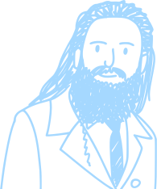
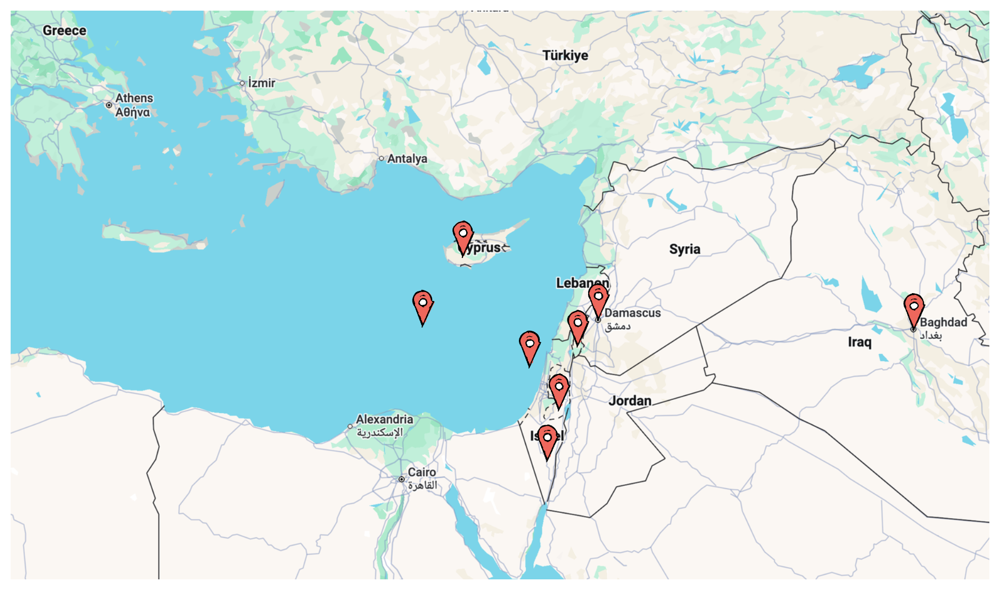
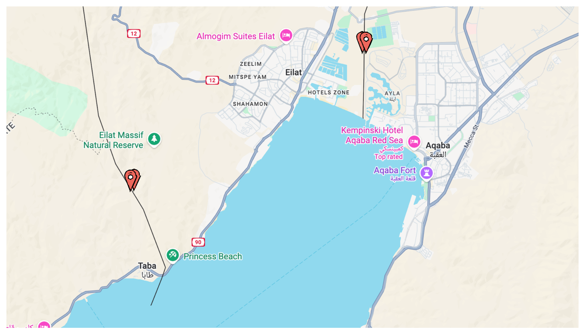

<!-- _class: lead -->

# Testing Masterclass

<span class="green">Aur Saraf</span>, PyCon IL 2025

---

# ToC

## Who, Why, What

## <span class="green">I</span> xUnit tests

## <span class="green">II</span> Evaluating prompts

## <span class="green">III</span> Other approaches

---

# Intro

## Who am I?

## Why test?

## What is testing?

---

<div class="flex">

<div>

# Intro

## Who am I?

<div class="red">Aur, startup CTO / consultant</div>
<div class="green">Wrote my first line of BASIC 27 years ago and fell in love</div>
<div class="blue">Run a programming Dojo every Wednesday 20:00 on Zoom</div>

## Why test?

## What is testing?

</div>



</div>

---

# Intro

## Who am I?

## Why test?

To <span class="green">build products faster</span>
Code <span class="red">never</span> works the first time
Working code <span class="red">won't stay working</span> if we leave it alone

## What is testing?

---

# Intro

## Who am I?

## Why test?

## What is testing?

Any activity that catches mistakes <span class="red">before production</span>
<span class="small">e.g. manual exploration, manual scripts, automated unit tests, automated e2e tests, fuzzing, running past production workloads, statistical evals, ...</span>
Testing is <span class="green">risk management</span>

---

<!-- _class: lead -->

# TESTING IS <span class="green">RISK MANAGEMENT</span>

# TESTING IS <span class="green">RISK MANAGEMENT</span>

# TESTING IS <span class="green">RISK MANAGEMENT</span>

---

<!-- _class: lead -->

# Part I - xUnit tests

#### Lets write a test

#### Choosing good test cases

#### Testing toolbox

#### Putting it to practice

#### War stories and design exercises

#### Things that are hard to test

---

<!-- _class: lead -->

# Lets write a test!

```python
# shekels.py

def amount_to_shekels_in_hebrew(amount):
    ...

print(amount_to_shekels_in_hebrew(1.01))
```

```
שקל אחד ואגורה אחת
```

---

Usually a test looks like this:

```python
def test_happy_path():
    value = 1.01
    result = amount_to_shekels_in_hebrew(value)
    assert result == "שקל אחד ואגורה אחת"
```

But lets start simple:

```python
def amount_to_shekels_in_hebrew(amount):
    ...
assert amount_to_shekels_in_hebrew(1.01) == "שקל אחד ואגורה אחת"
```

---

<!-- _class: lead -->

## Write and run 3-5 `assert` tests to convince yourself that <span class="green">הכל בסדר 👌</span>

```shell
git clone https://github.com/SonOfLilit/testing.git
cd testing
uv run python shekels.py
```

[https://docs.astral.sh/uv/getting-started/installation/](https://docs.astral.sh/uv/getting-started/installation/)

---

<!-- _class: lead -->

# <div class="outline-white">Choosing good test cases</div>


---

<!-- _class: lead -->

# <div class="green outline-white">Start simple</div>


---

<!-- _class: lead -->

# <div class="blue outline-white">Cover every subdivision of the problem space</div>



---

<!-- _class: lead -->

# <div class="yellow outline-white">There are surprising subdivisions</div>


---

<!-- _class: lead -->

# <div class="black outline-white">Hug borders tightly</div>



---

<!-- _class: lead -->

# <div class="red outline-white">Look for multipoints</div>


---

<!-- _class: lead -->

# <div class="outline-white">Again!</div>

```python
list(range(start=1, stop=10, step=3))  # => [1, 4, 7, 9]
```


---

<!-- _class: lead -->

# <div class="green outline-white">Start simple</div>

<div class="flex">

```python
assert (
    list(range(3)) == list(range(0, 3)) == 
    list(range(0, 3, 1)) == [0, 1, 2]
)
assert list(range(1, 3)) == [1, 2]
assert list(range(1, 6, 2)) == [1, 3, 5]
assert list(range(5, 0, -1)) == [5, 4, 3, 2, 1]
```


</div>

---

<!-- _class: lead -->

# <div class="blue outline-white">Cover every subdivision of the problem space</div>

<div class="flex">

```python
assert (
    list(range(3)) == list(range(0, 3)) == 
    list(range(0, 3, 1)) == [0, 1, 2]
)
assert list(range(1, 3)) == [1, 2]
assert list(range(1, 6, 2)) == [1, 3, 5]
assert list(range(5, 0, -1)) == [5, 4, 3, 2, 1]
assert list(range(3, 1)) == []
assert list(range(5, 5, -1)) == []
assert list(range(5, 0, -2)) == [5, 3, 1]
```


</div>

---

<!-- _class: lead -->

# <div class="yellow outline-white">There are surprising subdivisions</div>

<div class="flex">

```python
assert (
    list(range(3)) == list(range(0, 3)) == 
    list(range(0, 3, 1)) == [0, 1, 2])
assert list(range(1, 3)) == [1, 2]
assert list(range(1, 6, 2)) == [1, 3, 5]
assert list(range(5, 0, -1)) == [5, 4, 3, 2, 1]
assert list(range(3, 1)) == []
assert list(range(5, 5, -1)) == []
assert list(range(5, 0, -2)) == [5, 3, 1]
assert list(range(3, 4, 2)) == [3]
assert list(range(-1)) == []
try:
    list(range(2.5))
    assert False
except TypeError: pass
try:
    list(range(0, 3, 0))
    assert False
except TypeError: pass
```


</div>

---

<!-- _class: lead -->

# <div class="black outline-white">Hug borders tightly</div>

<div class="flex">

```python
assert (list(range(3)) == list(range(0, 3)) == 
        list(range(0, 3, 1)) == [0, 1, 2])
assert list(range(2, 3)) == [2]
assert list(range(3, 3)) == []
assert list(range(3, 2)) == []
assert list(range(-1)) == []
assert list(range(1, 6, 2)) == [1, 3, 5]
assert list(range(1, 5, 2)) == [1, 3]
assert list(range(1, 4, 2)) == [1, 3]
assert list(range(1, 3, 2)) == [1]
assert list(range(5, 0, -1)) == [5, 4, 3, 2, 1]
assert list(range(5, 4, -1)) == [5]
assert list(range(5, 5, -1)) == []
assert list(range(5, 0, -2)) == [5, 3, 1]
assert list(range(5, 0, -4)) == [5, 1]
assert list(range(5, 0, -5)) == [5]
with pytest.raises(ValueError):
    list(range(5, 0, 0))
with pytest.raises(TypeError):
    list(range(2.5))
```


</div>

---

<!-- _class: lead -->

# <div class="red outline-white">Look for multipoints</div>

<div class="flex">

```python
range(1)
range(0, 1)
range(0, 1, 1)

range(0, 1, 0)
range(0, -1, -1)

range(0, 0, 1)
range(0, 0, 0)
range(0, 0, -1)

range(0, 2, 1)
range(0, 2, 0)
range(0, -2, -1)

# what else?
```


</div>

---

<!-- _class: lead -->

# Now lets write some great tests!

```python
# shekels.py

def amount_to_shekels_in_hebrew(amount):
    ...
assert amount_to_shekels_in_hebrew(1.01) == "שקל אחד ואגורה אחת"
# what else?

# bonus:
def normalize_shekel_string(string):
    ...
assert normalize_shekel_string("שנים עשר שמונים") == "שתים עשרה שקל ושמונים אגורות"
```

Who can find a real bug? (I couldn't, but it's too much logic to not have any)

---

5m Intro

- 1m who
- 2m why test
- 2m what is testing

Part I - xUnit tests

- 10m lets write a test

  - 5m setup
  - 5m exercise

- 4m choosing good test cases
  - simple
  - cover every subdivision
  - there are surprising subdivisions
  - hug the borders tightly
  - look for multipoints
 - 5m again + exercise

- stateful systems
- advanced features:
  - given...when...then...
  - setup/teardown/fixture
  - parametrization
  - mocks
- putting it to practice
- war stories and design exercises
- things that are hard to test: UI, nondeterministic code

Part II - testing prompts with statistical tests (evaluations)

- lets use an LLM to process a freeform request
- how to think about "correctness"
- train/test split
- quality measures:
  - deterministic measurements
  - accuracy curve, false positives and false negatives
  - human as judge
  - strong LLM as judge
  - using a weak LLM to approximate confidence
- production monitoring

Part III - other approaches

- BDD
- FIT
- golden/snapshot testing
- exercise: tailoring a testing approach for a deterministic chatbot
- my own contribution to the field: bless tests
  - the basic technique
  - designing good harnesses
  - advanced blessing techniques
  - using it in a team
  - lessons learned applying it in the field
  - exercise: testing a complex algorithm with the blesstest library
- final design exercise

<style>
    @font-face {
        font-family: 'Excalifont';
        src: url('https://excalidraw.nyc3.cdn.digitaloceanspaces.com/fonts/Excalifont-Regular.woff2') format('woff2');
        font-weight: 400;
        font-style: normal;
        font-display: swap;
    }

    section {
        font-family: 'Excalifont';
        background: white;
        color: var(--oc-blue-6);

        &:where(.lead) {
            place-content: safe center center;

            /* Definitions for classic bhavior: Users can adopt flex centering by tweaking style `section.lead { display: flex }` */
            flex-flow: column nowrap;
            align-items: stretch;

            h1,
            h2,
            h3,
            h4,
            h5,
            h6 {
            text-align: center;
            }

            /* stylelint-disable-next-line no-descending-specificity */
            p {
            text-align: center;
            }

            blockquote {
            > h1,
            > h2,
            > h3,
            > h4,
            > h5,
            > h6,
            > p {
                text-align: left;
            }
            }

            ul,
            ol {
            > li > p {
                text-align: left;
            }
            }

            table {
            margin-left: auto;
            margin-right: auto;
            }
        }
}

    h1 {
        color: var(--oc-red-6);
    }
    h2 {
        color: var(--oc-yellow-6);
    }
    h3 {
        color: var(--oc-violet-6);
    }
    a[href] {
        text-decoration: underline;
    }
    p {
    }
    ul li {
        list-style-type: none;
    }
    ul li h2:before {
        content: "*";
        float: left;
        padding-right: .3em;
    }
    .small {
        font-size: .8em;
        color: var(--oc-orange-6);
    };
    .red {
        color: var(--oc-red-6);
    }
    .blue {
        color: var(--oc-blue-6);
    }
    .green {
        color: var(--oc-green-6);
    }
    .yellow {
        color: var(--oc-yellow-6);
    }
    .orange {
        color: var(--oc-orange-6);
    }
    .cyan {
        color: var(--oc-cyan-6);
    }
    .teal {
        color: var(--oc-teal-6);
    }
    .violet {
        color: var(--oc-violet-6);
    }
    .black {
        color: var(--oc-black);
    }
    .outline-white {
        text-shadow: -1px -1px 0 white, 1px -1px 0 white, -1px 1px 0 white, 1px 1px 0 white;
    }
    .white {
        color: var(--oc-white-6);
    }

    .flex {
        display: flex;
        flex-direction: row;
        align-items: center;
        gap: 50px;
    }
    .flex > * {
        flex-basis: 100%;
    }

    /*
    *
    *  𝗖 𝗢 𝗟 𝗢 𝗥
    *  v 1.9.1
    *
    *  ━━━━━━━━━━━━━━━━━━━━━━━━━━━━━━━━━━━ */

    :root {

    /*  General
    *  ─────────────────────────────────── */

    --oc-white: #ffffff;
    --oc-white-rgb: 255, 255, 255;
    --oc-black: #000000;
    --oc-black-rgb: 0, 0, 0;


    /*  Gray
    *  ─────────────────────────────────── */

    --oc-gray-0: #f8f9fa;
    --oc-gray-0-rgb: 248, 249, 250;
    --oc-gray-1: #f1f3f5;
    --oc-gray-1-rgb: 241, 243, 245;
    --oc-gray-2: #e9ecef;
    --oc-gray-2-rgb: 233, 236, 239;
    --oc-gray-3: #dee2e6;
    --oc-gray-3-rgb: 222, 226, 230;
    --oc-gray-4: #ced4da;
    --oc-gray-4-rgb: 206, 212, 218;
    --oc-gray-5: #adb5bd;
    --oc-gray-5-rgb: 173, 181, 189;
    --oc-gray-6: #868e96;
    --oc-gray-6-rgb: 134, 142, 150;
    --oc-gray-7: #495057;
    --oc-gray-7-rgb: 73, 80, 87;
    --oc-gray-8: #343a40;
    --oc-gray-8-rgb: 52, 58, 64;
    --oc-gray-9: #212529;
    --oc-gray-9-rgb: 33, 37, 41;


    /*  Red
    *  ─────────────────────────────────── */

    --oc-red-0: #fff5f5;
    --oc-red-0-rgb: 255, 245, 245;
    --oc-red-1: #ffe3e3;
    --oc-red-1-rgb: 255, 227, 227;
    --oc-red-2: #ffc9c9;
    --oc-red-2-rgb: 255, 201, 201;
    --oc-red-3: #ffa8a8;
    --oc-red-3-rgb: 255, 168, 168;
    --oc-red-4: #ff8787;
    --oc-red-4-rgb: 255, 135, 135;
    --oc-red-5: #ff6b6b;
    --oc-red-5-rgb: 255, 107, 107;
    --oc-red-6: #fa5252;
    --oc-red-6-rgb: 250, 82, 82;
    --oc-red-7: #f03e3e;
    --oc-red-7-rgb: 240, 62, 62;
    --oc-red-8: #e03131;
    --oc-red-8-rgb: 224, 49, 49;
    --oc-red-9: #c92a2a;
    --oc-red-9-rgb: 201, 42, 42;


    /*  Pink
    *  ─────────────────────────────────── */

    --oc-pink-0: #fff0f6;
    --oc-pink-0-rgb: 255, 240, 246;
    --oc-pink-1: #ffdeeb;
    --oc-pink-1-rgb: 255, 222, 235;
    --oc-pink-2: #fcc2d7;
    --oc-pink-2-rgb: 252, 194, 215;
    --oc-pink-3: #faa2c1;
    --oc-pink-3-rgb: 250, 162, 193;
    --oc-pink-4: #f783ac;
    --oc-pink-4-rgb: 247, 131, 172;
    --oc-pink-5: #f06595;
    --oc-pink-5-rgb: 240, 101, 149;
    --oc-pink-6: #e64980;
    --oc-pink-6-rgb: 230, 73, 128;
    --oc-pink-7: #d6336c;
    --oc-pink-7-rgb: 214, 51, 108;
    --oc-pink-8: #c2255c;
    --oc-pink-8-rgb: 194, 37, 92;
    --oc-pink-9: #a61e4d;
    --oc-pink-9-rgb: 166, 30, 77;


    /*  Grape
    *  ─────────────────────────────────── */

    --oc-grape-0: #f8f0fc;
    --oc-grape-0-rgb: 248, 240, 252;
    --oc-grape-1: #f3d9fa;
    --oc-grape-1-rgb: 243, 217, 250;
    --oc-grape-2: #eebefa;
    --oc-grape-2-rgb: 238, 190, 250;
    --oc-grape-3: #e599f7;
    --oc-grape-3-rgb: 229, 153, 247;
    --oc-grape-4: #da77f2;
    --oc-grape-4-rgb: 218, 119, 242;
    --oc-grape-5: #cc5de8;
    --oc-grape-5-rgb: 204, 93, 232;
    --oc-grape-6: #be4bdb;
    --oc-grape-6-rgb: 190, 75, 219;
    --oc-grape-7: #ae3ec9;
    --oc-grape-7-rgb: 174, 62, 201;
    --oc-grape-8: #9c36b5;
    --oc-grape-8-rgb: 156, 54, 181;
    --oc-grape-9: #862e9c;
    --oc-grape-9-rgb: 134, 46, 156;


    /*  Violet
    *  ─────────────────────────────────── */

    --oc-violet-0: #f3f0ff;
    --oc-violet-0-rgb: 243, 240, 255;
    --oc-violet-1: #e5dbff;
    --oc-violet-1-rgb: 229, 219, 255;
    --oc-violet-2: #d0bfff;
    --oc-violet-2-rgb: 208, 191, 255;
    --oc-violet-3: #b197fc;
    --oc-violet-3-rgb: 177, 151, 252;
    --oc-violet-4: #9775fa;
    --oc-violet-4-rgb: 151, 117, 250;
    --oc-violet-5: #845ef7;
    --oc-violet-5-rgb: 132, 94, 247;
    --oc-violet-6: #7950f2;
    --oc-violet-6-rgb: 121, 80, 242;
    --oc-violet-7: #7048e8;
    --oc-violet-7-rgb: 112, 72, 232;
    --oc-violet-8: #6741d9;
    --oc-violet-8-rgb: 103, 65, 217;
    --oc-violet-9: #5f3dc4;
    --oc-violet-9-rgb: 95, 61, 196;


    /*  Indigo
    *  ─────────────────────────────────── */

    --oc-indigo-0: #edf2ff;
    --oc-indigo-0-rgb: 237, 242, 255;
    --oc-indigo-1: #dbe4ff;
    --oc-indigo-1-rgb: 219, 228, 255;
    --oc-indigo-2: #bac8ff;
    --oc-indigo-2-rgb: 186, 200, 255;
    --oc-indigo-3: #91a7ff;
    --oc-indigo-3-rgb: 145, 167, 255;
    --oc-indigo-4: #748ffc;
    --oc-indigo-4-rgb: 116, 143, 252;
    --oc-indigo-5: #5c7cfa;
    --oc-indigo-5-rgb: 92, 124, 250;
    --oc-indigo-6: #4c6ef5;
    --oc-indigo-6-rgb: 76, 110, 245;
    --oc-indigo-7: #4263eb;
    --oc-indigo-7-rgb: 66, 99, 235;
    --oc-indigo-8: #3b5bdb;
    --oc-indigo-8-rgb: 59, 91, 219;
    --oc-indigo-9: #364fc7;
    --oc-indigo-9-rgb: 54, 79, 199;


    /*  Blue
    *  ─────────────────────────────────── */

    --oc-blue-0: #e7f5ff;
    --oc-blue-0-rgb: 231, 245, 255;
    --oc-blue-1: #d0ebff;
    --oc-blue-1-rgb: 208, 235, 255;
    --oc-blue-2: #a5d8ff;
    --oc-blue-2-rgb: 165, 216, 255;
    --oc-blue-3: #74c0fc;
    --oc-blue-3-rgb: 116, 192, 252;
    --oc-blue-4: #4dabf7;
    --oc-blue-4-rgb: 77, 171, 247;
    --oc-blue-5: #339af0;
    --oc-blue-5-rgb: 51, 154, 240;
    --oc-blue-6: #228be6;
    --oc-blue-6-rgb: 34, 139, 230;
    --oc-blue-7: #1c7ed6;
    --oc-blue-7-rgb: 28, 126, 214;
    --oc-blue-8: #1971c2;
    --oc-blue-8-rgb: 25, 113, 194;
    --oc-blue-9: #1864ab;
    --oc-blue-9-rgb: 24, 100, 171;


    /*  Cyan
    *  ─────────────────────────────────── */

    --oc-cyan-0: #e3fafc;
    --oc-cyan-0-rgb: 227, 250, 252;
    --oc-cyan-1: #c5f6fa;
    --oc-cyan-1-rgb: 197, 246, 250;
    --oc-cyan-2: #99e9f2;
    --oc-cyan-2-rgb: 153, 233, 242;
    --oc-cyan-3: #66d9e8;
    --oc-cyan-3-rgb: 102, 217, 232;
    --oc-cyan-4: #3bc9db;
    --oc-cyan-4-rgb: 59, 201, 219;
    --oc-cyan-5: #22b8cf;
    --oc-cyan-5-rgb: 34, 184, 207;
    --oc-cyan-6: #15aabf;
    --oc-cyan-6-rgb: 21, 170, 191;
    --oc-cyan-7: #1098ad;
    --oc-cyan-7-rgb: 16, 152, 173;
    --oc-cyan-8: #0c8599;
    --oc-cyan-8-rgb: 12, 133, 153;
    --oc-cyan-9: #0b7285;
    --oc-cyan-9-rgb: 11, 114, 133;


    /*  Teal
    *  ─────────────────────────────────── */

    --oc-teal-0: #e6fcf5;
    --oc-teal-0-rgb: 230, 252, 245;
    --oc-teal-1: #c3fae8;
    --oc-teal-1-rgb: 195, 250, 232;
    --oc-teal-2: #96f2d7;
    --oc-teal-2-rgb: 150, 242, 215;
    --oc-teal-3: #63e6be;
    --oc-teal-3-rgb: 99, 230, 190;
    --oc-teal-4: #38d9a9;
    --oc-teal-4-rgb: 56, 217, 169;
    --oc-teal-5: #20c997;
    --oc-teal-5-rgb: 32, 201, 151;
    --oc-teal-6: #12b886;
    --oc-teal-6-rgb: 18, 184, 134;
    --oc-teal-7: #0ca678;
    --oc-teal-7-rgb: 12, 166, 120;
    --oc-teal-8: #099268;
    --oc-teal-8-rgb: 9, 146, 104;
    --oc-teal-9: #087f5b;
    --oc-teal-9-rgb: 8, 127, 91;


    /*  Green
    *  ─────────────────────────────────── */

    --oc-green-0: #ebfbee;
    --oc-green-0-rgb: 235, 251, 238;
    --oc-green-1: #d3f9d8;
    --oc-green-1-rgb: 211, 249, 216;
    --oc-green-2: #b2f2bb;
    --oc-green-2-rgb: 178, 242, 187;
    --oc-green-3: #8ce99a;
    --oc-green-3-rgb: 140, 233, 154;
    --oc-green-4: #69db7c;
    --oc-green-4-rgb: 105, 219, 124;
    --oc-green-5: #51cf66;
    --oc-green-5-rgb: 81, 207, 102;
    --oc-green-6: #40c057;
    --oc-green-6-rgb: 64, 192, 87;
    --oc-green-7: #37b24d;
    --oc-green-7-rgb: 55, 178, 77;
    --oc-green-8: #2f9e44;
    --oc-green-8-rgb: 47, 158, 68;
    --oc-green-9: #2b8a3e;
    --oc-green-9-rgb: 43, 138, 62;


    /*  Lime
    *  ─────────────────────────────────── */

    --oc-lime-0: #f4fce3;
    --oc-lime-0-rgb: 244, 252, 227;
    --oc-lime-1: #e9fac8;
    --oc-lime-1-rgb: 233, 250, 200;
    --oc-lime-2: #d8f5a2;
    --oc-lime-2-rgb: 216, 245, 162;
    --oc-lime-3: #c0eb75;
    --oc-lime-3-rgb: 192, 235, 117;
    --oc-lime-4: #a9e34b;
    --oc-lime-4-rgb: 169, 227, 75;
    --oc-lime-5: #94d82d;
    --oc-lime-5-rgb: 148, 216, 45;
    --oc-lime-6: #82c91e;
    --oc-lime-6-rgb: 130, 201, 30;
    --oc-lime-7: #74b816;
    --oc-lime-7-rgb: 116, 184, 22;
    --oc-lime-8: #66a80f;
    --oc-lime-8-rgb: 102, 168, 15;
    --oc-lime-9: #5c940d;
    --oc-lime-9-rgb: 92, 148, 13;


    /*  Yellow
    *  ─────────────────────────────────── */

    --oc-yellow-0: #fff9db;
    --oc-yellow-0-rgb: 255, 249, 219;
    --oc-yellow-1: #fff3bf;
    --oc-yellow-1-rgb: 255, 243, 191;
    --oc-yellow-2: #ffec99;
    --oc-yellow-2-rgb: 255, 236, 153;
    --oc-yellow-3: #ffe066;
    --oc-yellow-3-rgb: 255, 224, 102;
    --oc-yellow-4: #ffd43b;
    --oc-yellow-4-rgb: 255, 212, 59;
    --oc-yellow-5: #fcc419;
    --oc-yellow-5-rgb: 252, 196, 25;
    --oc-yellow-6: #fab005;
    --oc-yellow-6-rgb: 250, 176, 5;
    --oc-yellow-7: #f59f00;
    --oc-yellow-7-rgb: 245, 159, 0;
    --oc-yellow-8: #f08c00;
    --oc-yellow-8-rgb: 240, 140, 0;
    --oc-yellow-9: #e67700;
    --oc-yellow-9-rgb: 230, 119, 0;


    /*  Orange
    *  ─────────────────────────────────── */

    --oc-orange-0: #fff4e6;
    --oc-orange-0-rgb: 255, 244, 230;
    --oc-orange-1: #ffe8cc;
    --oc-orange-1-rgb: 255, 232, 204;
    --oc-orange-2: #ffd8a8;
    --oc-orange-2-rgb: 255, 216, 168;
    --oc-orange-3: #ffc078;
    --oc-orange-3-rgb: 255, 192, 120;
    --oc-orange-4: #ffa94d;
    --oc-orange-4-rgb: 255, 169, 77;
    --oc-orange-5: #ff922b;
    --oc-orange-5-rgb: 255, 146, 43;
    --oc-orange-6: #fd7e14;
    --oc-orange-6-rgb: 253, 126, 20;
    --oc-orange-7: #f76707;
    --oc-orange-7-rgb: 247, 103, 7;
    --oc-orange-8: #e8590c;
    --oc-orange-8-rgb: 232, 89, 12;
    --oc-orange-9: #d9480f;
    --oc-orange-9-rgb: 217, 72, 15;

    }

</style>
